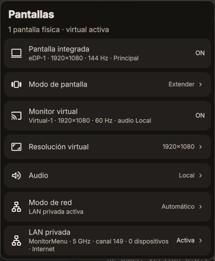
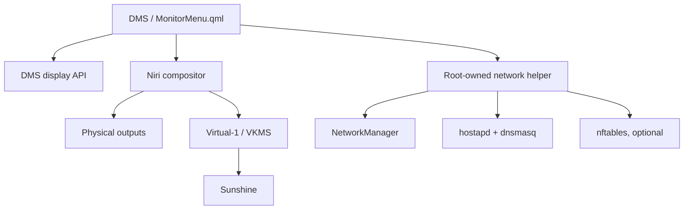

# Monitor Menu

Widget de DankMaterialShell para gestionar pantallas físicas, una salida virtual VKMS para Sunshine y conectividad privada adaptable en Niri.



## Features

- Detecta las salidas físicas de DMS/Niri y protege una salida principal elegida mediante una heurística.
- Ofrece `Solo principal`, `Duplicar` con wl-mirror y `Extender`.
- Gestiona `Virtual-1` mediante VKMS, Sunshine, resoluciones compatibles y audio Local/Virtual.
- Incluye los modos de red `Automático`, `Red actual` y `Bypass`.
- Crea una LAN privada aislada mediante hostapd, dnsmasq y nftables opcional.
- Mantiene los helpers privilegiados como copias root-owned con reglas sudoers de argumentos cerrados.
- Reduce actividad en reposo: el estado transitorio se consulta al abrir el menú y mientras permanece visible.

## Quick Start

Descarga y descomprime una release, entra en su carpeta y ejecuta como usuario normal:

```bash
./install.sh
dms restart
```

El instalador copia únicamente los archivos de ejecución a:

```text
~/.config/DankMaterialShell/plugins/MonitorMenu
```

Solicita `sudo` solo para instalar los helpers root-owned y sus reglas sudoers. No descarga código ni utiliza `curl | sudo sh`.

Instalación manual:

```bash
mkdir -p ~/.config/DankMaterialShell/plugins/MonitorMenu/components
install -m 0644 plugin.json MonitorMenu.qml MonitorMenuSettings.qml \
  ~/.config/DankMaterialShell/plugins/MonitorMenu/
install -m 0644 components/*.qml \
  ~/.config/DankMaterialShell/plugins/MonitorMenu/components/
install -m 0755 ./*.sh ~/.config/DankMaterialShell/plugins/MonitorMenu/
sudo sh ~/.config/DankMaterialShell/plugins/MonitorMenu/setup-vkms.sh install
sudo sh ~/.config/DankMaterialShell/plugins/MonitorMenu/setup-network.sh install
dms restart
```

## Requirements

- Niri 26.04, que es la versión base probada.
- DankMaterialShell 1.6 o posterior.
- Quickshell 0.3 o posterior.
- Kernel con el módulo `vkms`.
- Sunshine.
- NetworkManager/nmcli, hostapd, dnsmasq, iw, iproute2, sudo y visudo.
- wl-mirror para `Duplicar`.
- nftables para compartir Internet; la LAN local funciona sin él.
- jq recomendado para informar con precisión el modo virtual activo.

En Void Linux, las dependencias principales de red se instalan con:

```bash
sudo xbps-install -S NetworkManager hostapd dnsmasq iw iproute2 nftables sudo
```

## Network Modes

| Modo | Comportamiento |
| --- | --- |
| `Automático` | Intenta crear la LAN privada al iniciar. Si el intento inicial falla, usa la red actual. |
| `Red actual` | Sunshine utiliza directamente la red existente; no crea interfaz AP. |
| `Bypass` | Crea una LAN privada directa para el receptor y sigue el canal del uplink cuando el hardware lo exige. |

SSID, contraseña y MAC local persisten bajo `/var/lib/monitor-menu-network` con permisos root-only. Cuando existe conectividad y nftables está disponible, el helper comparte Internet únicamente entre la interfaz privada y la ruta detectada.

Durante asociaciones de NetworkManager, el watcher puede pausar brevemente el AP. Tras estabilizarse la nueva asociación reconstruye la LAN en el canal adecuado; sin uplink intenta un canal autónomo permitido.

## Dynamic State

La interfaz obtiene del sistema efectivo:

- interfaz AP y uplink;
- SSID, dirección del host, banda y canal;
- clientes asociados;
- estado `UPLINK`, `CONNECTING`, `STANDALONE` o `RECONFIGURING`;
- disponibilidad de Internet compartido.

`Host` y `Clave` están ocultos por defecto. Se consultan solo al interactuar y se copian con `TextInput.copy()` de Qt. La contraseña no forma parte del polling, no se guarda en PluginSettings y no se registra en logs.

## Architecture



`MonitorMenu.qml` conserva el estado y la orquestación. `components/` contiene la presentación. Los scripts de setup instalan los helpers privilegiados en `/usr/local/libexec`; QML nunca ejecuta como root una copia modificable dentro del plugin.

## Sunshine And Audio

El helper configura `output_name = Virtual-1`.

Audio `Local`:

```ini
output_name = Virtual-1
stream_audio = disabled
```

Audio `Virtual`:

```ini
output_name = Virtual-1
stream_audio = enabled
virtual_sink = sink-sunshine-stereo
```

La selección se guarda bajo el estado de usuario de Monitor Menu. Si `Virtual-1` está activo, cambiar el audio reinicia Sunshine de forma controlada.

## Diagnostics

Estado del monitor virtual:

```bash
~/.config/DankMaterialShell/plugins/MonitorMenu/virtual-monitor-helper.sh status
```

Estado VKMS root-owned:

```bash
sudo -n /usr/local/libexec/monitor-menu-vkms status
```

Estado de red, sin contraseña:

```bash
sudo -n /usr/local/libexec/monitor-menu-network status
```

Salidas visibles:

```bash
niri msg outputs
dms randr --json
```

El log de red requiere autorización sudo normal porque no está incluido en las reglas NOPASSWD:

```bash
sudo /usr/local/libexec/monitor-menu-network log 100
```

Nunca publiques ni adjuntes la salida de `secret password`.

Si Moonlight acepta el PIN pero muestra `Certificate verification failed`, revisa primero el log de Sunshine y actualiza las versiones nocturnas antiguas. El error `Client certificate identity is not enabled` puede indicar identidades duplicadas; elimina únicamente los registros duplicados y no regeneres `cakey.pem` ni `cacert.pem` sin una copia de seguridad.

## Manual Tests

No ejecutes cambios de canal durante una sesión remota que no puedas recuperar localmente.

1. Comprueba una pantalla física y el hotplug con el menú abierto y cerrado.
2. Prueba `Solo principal`, `Extender` y `Duplicar`.
3. Enciende `Virtual-1` y confirma `capture=virtual` en el estado.
4. Cambia entre 900p y 1080p y confirma el modo en DMS/Niri.
5. Cambia Audio entre Local y Virtual.
6. Prueba `Red actual`: `lan_active=0` y `mm-ap0` no debe existir.
7. Prueba `Automático` y `Bypass` con uplinks de 5 GHz y 2.4 GHz.
8. Desconecta el uplink y comprueba la recuperación standalone tras el debounce.
9. Apaga el monitor virtual y confirma la limpieza de Sunshine, AP, procesos y reglas propias.
10. Reinicia DMS con el monitor virtual ON y OFF.

La lista completa previa a una publicación está en [`docs/RELEASE_CHECKLIST.md`](docs/RELEASE_CHECKLIST.md).

## Security

- Los helpers autorizados son root-owned y aceptan operaciones y argumentos cerrados.
- El estado persistente y la contraseña usan permisos root-only.
- La configuración temporal de hostapd que contiene la clave usa modo `0600`.
- El estado periódico y los logs no contienen la contraseña.
- Las reglas nftables viven en una tabla propia y solo se eliminan si existe el marcador de ownership del plugin.
- `ap_isolate=1` evita comunicación directa entre clientes del AP.
- Un cliente que conoce la clave puede acceder a servicios expuestos por el equipo en la interfaz privada, incluido Sunshine.
- El portapapeles del escritorio puede conservar temporalmente un valor copiado después de ocultarlo.

## Uninstallation

Apaga primero el monitor virtual. Después ejecuta desde la carpeta instalada:

```bash
sudo sh ~/.config/DankMaterialShell/plugins/MonitorMenu/setup-network.sh remove
sudo sh ~/.config/DankMaterialShell/plugins/MonitorMenu/setup-vkms.sh remove
rm -rf ~/.config/DankMaterialShell/plugins/MonitorMenu
dms restart
```

El desinstalador de red conserva el helper si la limpieza falla. La identidad persistente de red permanece en `/var/lib/monitor-menu-network` para una reinstalación futura y puede eliminarse manualmente si ya no se necesita.

## Optional Variables

`MONITOR_MENU_SUNSHINE_STRATUM` selecciona el estrato de Bedrock usado para Sunshine; el valor predeterminado es `arch`. El nombre del output virtual no es configurable desde la interfaz y se mantiene como `Virtual-1`.

## Known Limitations

- Monitor Menu está diseñado para DankMaterialShell sobre Niri; no gestiona otros compositores.
- La salida protegida como principal se elige por heurística: primero un `eDP-*` activo, luego cualquier `eDP-*` y finalmente la primera salida física activa.
- El plugin espera controlar en exclusiva un conector VKMS. No está diseñado para coexistir con otro gestor de VKMS ni para administrar varias salidas virtuales.
- Al apagar el monitor virtual se desconecta el conector para retirarlo de Niri/DMS, pero el módulo `vkms` puede permanecer cargado porque Niri conserva abierto el dispositivo DRM.
- La disponibilidad de VKMS y sus modos depende del kernel. Solo se ofrecen presets de 60 Hz que VKMS/Niri anuncian realmente.
- Sunshine depende de que `Virtual-1` esté anunciado y listo. Monitor Menu controla la instancia Sunshine del usuario y modifica `~/.config/sunshine/sunshine.conf`; los valores anteriores no se restauran automáticamente.
- `Duplicar` utiliza ventanas fullscreen de wl-mirror, no clonación nativa del compositor.
- La LAN privada requiere un adaptador y controlador capaces de mantener interfaces managed y AP de forma concurrente.
- En muchos adaptadores, managed y AP deben compartir canal. Los cambios de asociación o canal pueden causar cortes breves.
- Se admiten uplinks de 2.4 y 5 GHz para adaptar el AP; los uplinks Wi-Fi de 6 GHz no están soportados actualmente.
- `Automático` hace fallback a la red actual si falla la creación inicial del AP; un fallo posterior del watcher puede provocar pausa y reintentos en lugar de cambiar inmediatamente a `Red actual`.
- La red privada está vinculada al lifecycle de `Virtual-1` y no se ofrece como función independiente.
- La interfaz y subred privadas predeterminadas son `mm-ap0` y `10.77.0.0/24`; no son configurables desde la UI.

## Development

Validación local:

```bash
find . -type f -name '*.sh' -exec dash -n {} \;
find . -type f -name '*.sh' -exec shellcheck --shell=sh {} +
python3 tests/validate-manifest.py
dash tests/test-helpers.sh
git diff --check
```

CI usa `qmlformat` como parser ligero. `qmllint` completo requiere los módulos QML de DMS y no se ejecuta para evitar falsos positivos por imports ausentes.

## Repository Metadata

Descripción sugerida:

> DMS/Niri widget for physical displays, VKMS virtual monitors, Sunshine and adaptive private networking.

Topics sugeridos: `dankmaterialshell`, `dms`, `niri`, `wayland`, `qml`, `quickshell`, `linux`, `vkms`, `sunshine`, `monitor-management`, `virtual-display`.

## License

MIT. Consulta [`LICENSE`](LICENSE).
